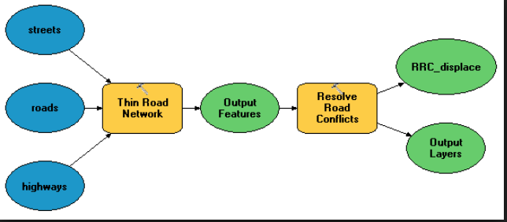

Daniel Carver
2/13/2018

[github: dcarver1 ](https://github.com/dcarver1)


# Outline

**Goal provide some tips and tools to make arcpy a viable extension of arcmap**

1. python
2. what is arcpy
3. why is it useful
4. interface for engaging with arcpy
5. What it is good at

  1. environmental variables

    - examples

  2. iterating

    - examples

  3. reproducibility

    - examples

6. What it is bad at

  1. search cursor

    - examples

  2. very specific formatting

    - examples

  3. it will make easy things in arcmap hard, at first

    - examples ( temp objects )

7. Flowcharts activity

  - have them plan out a geoprocessing process

8. Online resources

## Python

python is awesome. It is a full computer science language that has functionality in a wide range of fields I don't really want to spend that much time with python generals here, but I've included and awesome introduction to python that I use to learn the language.

You can find it here [link to python intro](fill in link to the github page) I did not write this material, but is great.

**ArcMap uses python 2.7**

**ArcPro uses python 3.6**

## What is arcpy

Arcpy is essentially a python library that allows the user to access all the geoprocessing tools of arcpy via a python script. Arcpy does require an active license to Arcmap Arcpy is composed of modules, classes, and functions

- Modules are essentially the extensions of arcpy. If you want to reference a tool form that requires a spatial analyst license you will be calling that function from the spatial analysis module.

```python
import arcpy

arcpy.CheckExtensions("Spatial") #checks out the licensed extension
```

- classes provide the framework that specific functions are built from. They are not as readily used as functions.

```python
import arcpy

object1 = arcpy.Extent("path to layer")# this stores extent multiple properties to
# the object. ex(Xmin, Xmax, Ymin)

print ( object1.Xmin) # you can then select specific extent properties from the
# objects
```

- Function are the comparable to the tools that you use in the arcmap interface. You will often call functions to perform a certain task.

```python
import arcpy #import library
from arcpy import env #import the environment class

env.workspace = r"C:/data" #calling the 'workspace' function from the env class
arcpy.Clip_analysis("majorrds.shp", "study_quads.shp", r"C:/output/studyarea.shp")
# clipping a shp and saving the output with a defined name and location.
```

Functions has a sets of inputs that must be followed. Here is the example for cliping

[clip tool](http://pro.arcgis.com/en/pro-app/tool-reference/analysis/clip.htm) Clip_analysis (in_features, clip_features, out_feature_class, {cluster_tolerance}) in_features = feature layer clip_features = feature layer out_feature_class = feature class {cluster_tolerance} = optional

_You need to look at the documentation to know what each input is required to be_

## why is it useful

### promotes high level understanding of geospatial processing

using arcpy will force you to look at the geoprocessing tools in greater detail. You will inevitably end up having a better understanding of the tools.

### increases efficiency and reproducibility

Writing an arcpy script is essentially like writing a well documented outline. The method and the steps are inherent within the script. Also because it is ran via a computer it simply does what it is told this allows you to repeat the same task over and over without fear of forgetting to add one of those parameters.

### If you know it in ArcMap you can make it happen in Arcpy

If your familiar with working in arcmap you already know a lot about arcpy. I will be working on drawing the comparison between the two throughout this tutorial

## Engaging with Arcpy

Most people will end up using arcpy via the built in text editor within arcpy called IDLE. This is not the greatest text editor or development environment but it is really the easiest to use. Arcpy is installed with Arcmap as part of a stand alone distribution of python. So you try to use a separate development environment you need to show your computer where to look for all the modules, classes, and functions of arcpy. Therefore, if you don't want to use IDLE, you need to do some work to set up your development environment before you can call 'import arcpy' and successful gain access to the material you are looking for.

1. Use IDLE

IDLE is a built in text editor that is included with any arcmap installation. It's a no thrills development environment that works for python and python alone. When arcmap is installed it also installs a version of python. Everything you need to get coding in arcpy is wrapped up nicely for you. The only trouble is that the wrapping is a bit ugly and cumbersome. If your new to programming you wont be able to tell it's ugly and cumbersome so rolling with it might be the way to go. Sooner or later your going to want out and the next easiest step is to move to using Anaconda.

1. Use Anaconda

Anaconda is a python development system that provides a Integrated Development Environment (IDE) Spyder that allows you to code and troubleshoot all within the same program. What's nice about anaconda is that it install a more robust set of packages and libraries for python, so you can use other libraries much easier. Remember that python is a whole computer language, we are just using a single rather small portion of it's functionality. I liked using spyder because it opens up the bigger picture of python. By the time you find yourself switching from saying I use python to write in arcpy to I write in python and can use arcpy, your going to want something that gives a bit more then IDLE.

Here are instructions for making sure you can access the arcpy libraries within the spyder IDE Instructions for installing ArcGIS and anaconda

You can download Anaconda at <https://www.continuum.io/downloads>. Follow the appropriate instructions below for your environment:

ArcGIS 10.X already installed:

1. Install anaconda. You can proceed with all of the default installation options.

2. Launch Spyder after the installation. Go to Tools -> PYTHONPATH manager

  Add the following paths: C:\Program Files (x86)\ArcGIS\Desktop10.2\arcpy C:\Program Files (x86)\ArcGIS\Desktop10.2\bin

3. restart the program

If your arcGIS was installed in a different location you may have a different path. In this case just make sure your connected to the correct folder or this will not work.

1. Use Atom/CMD You can use a text editor such as arcpy but it will take a bit more set up If your interested check out this [post](http://www.siliconcreek.net/computers/running-python-in-atom-io-in-windows) or you can add the python installation associated with the arc map installation of python to the environmental variables of your pc. This method will require administrative privileges on your pc. So if your on your own pc it should work if your working with a government computer this will most like not work <https://docs.python.org/2/using/windows.html>

At the end of the day, it's really the product that matters. I bring up these options because it is important to look ahead. But how you get there really is a matter of your own personal preference.

## What is arcpy good at?

The truth is that arcpy is really pretty awesome. It's the functionality of arcmap with the flexibility of a programming language. I would say the greatest benefit of learning to use arcpy is that it helps you better understand what these geoprocessing tools are really doing. I've listed a few features below that really stand out about arcpy.

### python, your the best

We're going to be viewing alot more code examples below and there is a super helpful built in function in python that you really ought to know. windows operating systems uses the backslash ('\') symbol to distinguish between folders in paths, for example c:\users\documents\stuff

The trouble is that to most programming languages the backslash is an escape symbol. Specifics aside basically it is character that has a specific meaning that can not be overwritten. So python would read this path 'c:\users\documents\stuff' as 'c:' That's no bueno.

Luckily there is a quick fix. Placing the letter 'r' in front of the path will tell python to treat the string as a raw string which takes the functionality away from the backslashes. so you path should look like this path = r'c:\users\documents\stuff'

beautiful Ok, now back to arcpy.

### environmental variable

On of the trademarks of good work is that it can be done consistently. Programming inherently bring in greater consistence because computers only do what you tell them to do. In geospatial work there are a lot of variables that you want to keep consistent across the analysis, such as projection, cell size, or extent. Arcpy makes that easy.

<--put a picture here of the environmental variable button on a geoprocessing tool !-->

Just like under the options of a geoprocessing tool you can set specific environmental variables by calling specific functions from the env class of arcpy. A full list of functions can be found at the link below and a few of the major ones will be highlighted below.

[env class](http://pro.arcgis.com/en/pro-app/arcpy/classes/env.htm)

If you want to know a little more about this process here is a good resource

[using environmental variables in python](http://pro.arcgis.com/en/pro-app/arcpy/geoprocessing_and_python/using-environment-settings.htm)

```python
import arcpy

# Set the workspace environment to local file geodatabase
arcpy.env.workspace = r"C:/data/base.gdb"
# I like to set this as a variable because it can help with name of features down the road
workspace = arcpy.env.workspace = r"C:/data/base.gdb"

'''
this is how you comment out multiple lines of code below are notes on arcpy.env.workspace


this means that you can pull objects from that workspace by calling there names
bluePrint = 'bluePrint.shp'

Also any output files will be save to that location automatically.

If you ever want to work outside of the workspace
'''

# Set the workspace, outputCoordinateSystem
arcpy.env.outputCoordinateSystem = arcpy.SpatialReference("WGS 1984 UTM Zone 18N")

# the out put of this function will have the coordinate system of "WGS 1984 UTM Zone 18N"
arcpy.Buffer_analysis("roads.shp", "roads_buffer.shp", "10 meters")

# Setting the extent of analysis
arcpy.env.extent = r"C:/data/studyArea"

# Set Snap Raster environment
arcpy.env.snapRaster = "C:/data/my_snapraster"
# this will align all outputs to match the grid of the given raster.

#With a function such as cell size you can define the parameter in multiple ways
# Set the cell size environment using a keyword.
arcpy.env.cellSize = "MINOF"
#this will set the cell size to that of the minimum cell size raster in the analysis

# Set the cell size environment using a number.
arcpy.env.cellSize = 20

# Set the cell size environment using a raster dataset.
arcpy.env.cellSize = "C:/sapyexamples/data/myraster"
```

```python
def extents(fc):
    """
    This function takes in an arcpy object and returns the spatial extent features
    """
    extent = arcpy.Describe(fc).extent
    west = extent.XMin
    south = extent.YMin
    east = extent.XMax
    north = extent.YMax
    width = extent.width
    height = extent.height
    return west, south, east, north, width, height
```

### iterating

one of the biggest perks of programming is that you can make the computer do the boring stuff. Iterators are a perfect example of such a process. Lets say you have 15 rasters that you need to mask and re project to a different coordinate system.

You can run 30 geoprocessing tool in arc map or write a script

```python
#pull in the library
import arcpy
#set the workspace
workspace = r'c:\rasters'
#set the environmental varible for a mask
arcpy.env.mask = r"C:/data/maskpoly.shp"
#enable overwrite so you can re write files with the same name
arcpy.env.overwriteOutput = True

#pull in a list of all the raster in a workspace
rasters = arcpy.ListRasters(workspace)
# view all the raster
print(raster)

#write a for loop to iterate over the list
for raster in rasters:
  arcpy.ProjectRaster_management(raster, raster+'_pro')
  print('The raster'+raster +' has been projected and masked.')
```

This save a lot of time!

Let's break down the for loop a bit.

```python
list = [1,2,3,4]
for element in list:
  # for each element in the list do something...
  print(element)
1
2
3
4
```

There are lots of options for loops and they can get complex. But it is really only when you start to implement loops that you find yourself appreciating the power of programming

### Reproducibility

It's just a simple matter of fact that at some point down the road someone is going to ask you "Hey, remember that project from way back when. How did you get those results?" The nerves will surge in your stomach as you realize you don't really remember. Luckily you wrote more of that process into code. If you wrote it out well most of the information about the process should be

Take a look at these two examples and see if you can follow the process

```python
## Import correct modules
import arcpy, os
from arcpy import env

## set working directory variable
folder_path = r'C:\Users\spater\Desktop\InSitu_Sites\Round2\Projected'

## set working directory
arcpy.env.workspace= folder_path

## set outpath directory -- where buffered files will be saved
outpath = r'C:\Users\spater\Desktop\InSitu_Sites\Round2\Buffered_200'

## creates a list of shapefiles within the workspace
fcList = arcpy.ListFeatureClasses()

## for every shapefile in the list create a 200 meter buffer around it and export
## it as a new shapefile to the outpath location
for fc in fcList:
    outname = os.path.join(outpath, fc + "_buffer.shp")
    arcpy.Buffer_analysis(fc, outname, "200 Meters")
```

```python
import arcpy
from arcpy import env
from arcpy.sa import *

env.workspace = r"C:\GIS Data\Cameron_Run\Topo_NED\Projected"

# Set local variables
surfaceRaster = "raw_10m_dem"

# Check out the ArcGIS Spatial Analyst extension license
arcpy.CheckOutExtension("Spatial")

# Execute FlowDirection
fillRaster = Fill(surfaceRaster)
arcpy.RasterToGeodatabase_conversion(fillRaster, r"C:\GISData\Cameron_Run\Topo_NED\Projected\fillRasterGDB.gdb")
```

What you scripts will really become are a clean and practical set of instructions on how the work was done. They are a written description of your process. If you want to redo your work or change parameters based on new information it all there for you. Because you have this reproducibility you can more easily start conduction more robust analysis such as sensitivity analysis.

## What is arcpy max(bad) at...

Generally specking the learning curve is often the most frustrating part. That said there are a few that will often leave you scratching you head. Consider this section a bit of a heads up.

### Cursors

Because arcpy is written with python for loops are really very easy. However, if you want to loop through all attributes within a feature class things are just not quite as start forward. Arcpy requires you to use a cursor. These cursors allow you to , update, or insert information to the rows of a feature class. Theses are called

- search cursor
- update cursor
- insert cursor

[cursors](http://pro.arcgis.com/en/pro-app/arcpy/get-started/data-access-using-cursors.htm)

You use these cursors to create a cursor object. The cursor object then has specific funtions. It's getting kinda funky huh? lets look at some examples.

**Search Cursor** The search cursor is a read only function. This mean you can use it to extract information from a feature class but you can not change any information within that feature class. This is perfect for extracting specific values. You can incorporate where clauses into these search cusors but were going to pass on that for now

[search cursors](http://pro.arcgis.com/en/pro-app/arcpy/data-access/searchcursor-class.htm)

In this example we want a printed list of information pertaining to a well system.

```python
import arcpy

# define your dataset
fc = 'c:/data/base.gdb/well'
# define what field you want to search through
fields = ['WELL_ID', 'WELL_TYPE', 'SHAPE@XY']

# For each row print the WELL_ID and WELL_TYPE fields, and
# the feature's x,y coordinates
with arcpy.da.SearchCursor(fc, fields) as cursor:
    for row in cursor:
        print(u'{0}, {1}, {2}'.format(row[0], row[1], row[2]))
```

This will print something line well203494, super3, 100.3949,23.4858 for all rows in the feature class.

Now were seeing a new function here. 'with' Cursors are objects that stay for open until you tell them to close. What this means is that the feature will be held in memorny and un able to be edited by other function while you cursor is open. The exact logo behind this process is beyond me, but if you don't follow it, it will come back and bite you.

What the with function does is closes the cursor after it has complete it's series of tasks within the object. The example below shows the same thing.

```python

cursor=arcpy.SearchCursor(IN_Table)
for row in cursor:
    printf=row.getValue(row[0])
    print(printf)
del row, cursor

#or with with

with arcpy.SearchCursor(IN_Table) as cursor:
    printf=row.getValue(row[0])
    print(printf)
```

The with example is what we would call more pythonic.

**Update cursor** This allows you to rewrite existing layers.

```python
import arcpy

#define
fc = 'c:/data/base.gdb/well'
fields = ['WELL_YIELD', 'WELL_CLASS']

# Create update cursor for feature class
with arcpy.da.UpdateCursor(fc, fields) as cursor:
    # For each row, evaluate the WELL_YIELD value (index position
    # of 0), and update WELL_CLASS (index position of 1)
    for row in cursor:
        if (row[0] >= 0 and row[0] <= 10):
            row[1] = 1
        elif (row[0] > 10 and row[0] <= 20):
            row[1] = 2
        elif (row[0] > 20 and row[0] <= 30):
            row[1] = 3
        elif (row[0] > 30):
            row[1] = 4

        # Update the cursor with the updated list
        cursor.updateRow(row)
```

### Conditional Formatting

In arcmap you use conditional statements all the time. Conditional statements are things such as "select all citys that fall with 50 miles of the this location" Select by attributes is probably the main function that uses conditional statements. These can be tricky to get correct even with the graphical user interface (interface) that is provided. What you don't see is that what you enter is only part of statement. In arcpy you are now responsible for entering all components of the conditional statements and it is challenging to get correct.

```python
def shpExtent(shape):
    """
    inputs a shapefile and returns the target points for the warp function
    shape: needs to be a path to a specific shapefile
    """
    #create bounding box around shapefile
    shapeBox = arcpy.MinimumBoundingGeometry_management(shape,
                                             "bounding_box",
                                             "RECTANGLE_BY_AREA")
    #call extent function on shapefile
    w1, s1, e1, n1, wid1, hgt1 = extents(shapeBox)
    #start the formatting for the warp function
    topLeft1 = str(w1) + " " + str(n1)
    topRight1 = str(e1) + " " + str(n1)
    bottomLeft1 = str(w1) + " " + str(s1)
    bottomRight1 = str(e1) + " " + str(s1)

    #aside
    targetPoints = " '{}';'{}';'{}';'{}'".format(topLeft1,topRight1,bottomLeft1,bottomRight1)
    return targetPoints
```

**tips** When you need to write a conditional statement open arc map and write it out using the select by attribute tool or the raster math tool. This will allow you to select the correct text format. From there check out this site _link to the conditional format arcpy site_ Depending on what you are trying to do you will have too follow a specific format. Look this up to save your self the trouble of trying to guess it.

### The learning Curve

I mentioned above that the most difficult aspect of arcpy is the learn curve. You go from being able to buffer a .shp in 4 minutes to feeling like your dumber then a box of rocks over the course of two hours. I wish I had a clever work around for this but I really don't. Here is an example of a easy process in arcmap that gets a lot harder in arcpy.

```python
# Name: ExtractFeaturesByLocationAndAttribute.py
# Description:  Extracts features to a new feature class based on a location and an attribute query.

# Import system modules
import arcpy

# Set overwrite option
arcpy.env.overwriteOutput = True

# Put in error trapping in case an error occurs when running tool
try:

   # Make a layer from the feature class
   arcpy.MakeFeatureLayer_management("C:/data/mexico.gdb/cities","cities_lyr")

   # Select all cities that overlap the chihuahua polygon
   arcpy.SelectLayerByLocation_management("cities_lyr", "INTERSECT", "c:/data/mexico.gdb/chihuahua", "", "NEW_SELECTION")

   # Within the selection (done above) further select only those cities that have a population >10,000
   arcpy.SelectLayerByAttribute_management("cities_lyr", "SUBSET_SELECTION", "POPULATION > 10000")

   # Write the selected features to a new featureclass
   arcpy.CopyFeatures_management("cities_lyr", "c:/data/mexico.gdb/chihuahua_10000plus")

except:
   print(arcpy.GetMessages())
```

The saving grace of this is that as you get better the time it takes to get the ball rolling decreases and you will eventually find yourself opening arcmap less and less.

1. Flowcharts activity



Don't start programming in python. Sounds silly right, but like anything else the more you plan the smoother the process tends to go. I would suggest writing out a flowchart of your process, just with concepts, and explain that process to someone else. If it makes sense to them, go back and fill in that flow chart with more details. Find the specific functions you want to use, look at the requirements of that function, and try to understand if the process is really going to work. If your confident with it then start coding.

If you want to use a for loop try to get the code to work first and then implement the for loop.

If you have a issue, try to write out your problem, in words, and start explaining it to others. This will help you define what the issue actually is. If everyone you spoke to said, yeah that looks right, you probably used a zero in stead of an o or some other silly thing like that.

**Print Statements**

Use print statements always and often when writing the code. here is an example

```python
import arcpy
import os
import numpy and np

print('all modules have loaded')

raster = r"C:\pahtToRaster"

print('raster loaded')

rasterDouble = raster * 2

print('raster values have been multipled')
```

it looks crazy I know but if a print statement completes you know what has occurred in your code. IF you don't do this you will inevitable set a code to run overnight and return to an undefined 999999 error and will have no idea what when wrong. Troubleshooting scripts that take a long time to run is very very time consuming. So print('a lot') and you can remove them later.

1. Last words of wisdom

**Error Messages are your friends**

IF you code throws a error message, and it will, often. Read the whole message and try to make sense of it before you start bashing your computer. Most error messages will have a helpful numerical code associated with them the you can use to search for more details. The really frustrating one is error 999999 or which is essentially an uncaught error. This means that the you made an error that the programmers did not test for, therefore the function can not tell you what actually went wrong. I often find that these tend to be formatting issues. You used a comma instead of a semicolon or you misspelled the feature class you told the function to look for. Silly mistakes that cause real life pain and sorrow. So when an error pops, be happy because it is a clue.

**Ask for help quickly**

Programming is a community. An online community that is frank and at the end of the day helpful. Get comfortable searching through stackexchange and ESRI forums. You can sometimes find the exact answer to your question and more often then not you can find something that can get you closer. Success in this process has a lot to do with how you ask your question in the first place, that's why we write them out.

**baby steps**

In the beginning you will benefit from running code line by line to ensure that certain aspects of the code works. This is a not a great long term practice but it can help make you feel like you are getting someone.

**code for fun**

IF you really want to keep this up long term try to apply your programming skills to something that just interest you. And try try try, you will make 40 mistakes before you get it right. The value of those mistakes really comes down to the attitude you bring to the table.

**Understand that a functioning code and a pile of text is wholly dependent on you**

computers are good at following orders. Scripts are how we can communicate with computers. We write scripts, not the computer. Understand that you are learning and it is not the computers fault. Scapegoats are great but they are not productive in the long term.

> **If you want it, you can have, you just have to learn to reach out there are grab it.**


 ```python
# -*- coding: utf-8 -*-
"""
Code for setting up the extract multiple values to points in arcpy
The text input is kinda pain in the but so this script uses
glob and some for loops to streamline the process.
Dan Carver 9/28/17
"""

import arcpy
import glob
import os
import time
from arcpy import env
from arcpy.sa import *
arcpy.env.overwriteOutput = True
arcpy.CheckOutExtension("Spatial")
print("spatial analysis has been checked out")

start = time.time()

# Set to the folder location that contains all the raster information
workspace = arcpy.env.workspace = r"G:\DEVELOP_Fall2017_CRBII\DEVELOP-CRB\Indicies\LS5\p035r034"

#select all the files that end in .tif within the defined workspace
rasterList = (glob.glob(workspace + "\\*.tif"))

# define the point feature for extract value process
inPointFeatures = r"C:\Users\research\Documents\ArcGIS\Default.gdb\RO_present_06_field_inVbet"

print "this is the feature bring worked with ", inPointFeatures, '.'
#create an empty list
inRasterList =[]
#itorate through the list of raster names
for i in rasterList:
    txtname = os.path.basename(i)#select the final segemnt of the path
    file_name = [i,(str(txtname)[12:-4])]# create a list of file directory and file name
    inRasterList.append(file_name)# append the list to a second list of

print('the raster list has been created')

# Execute ExtractValuesToPoints
print "The extract multiple values to points tool is running, be patient."
ExtractMultiValuesToPoints(inPointFeatures, inRasterList)
end = time.time()

print "This process ran in ",(end-start)/60 ,"minutes."
```
